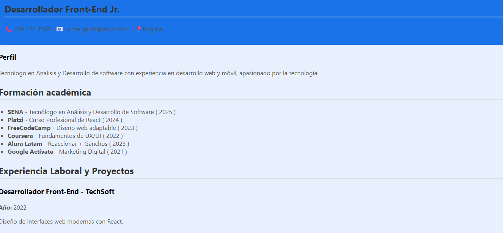
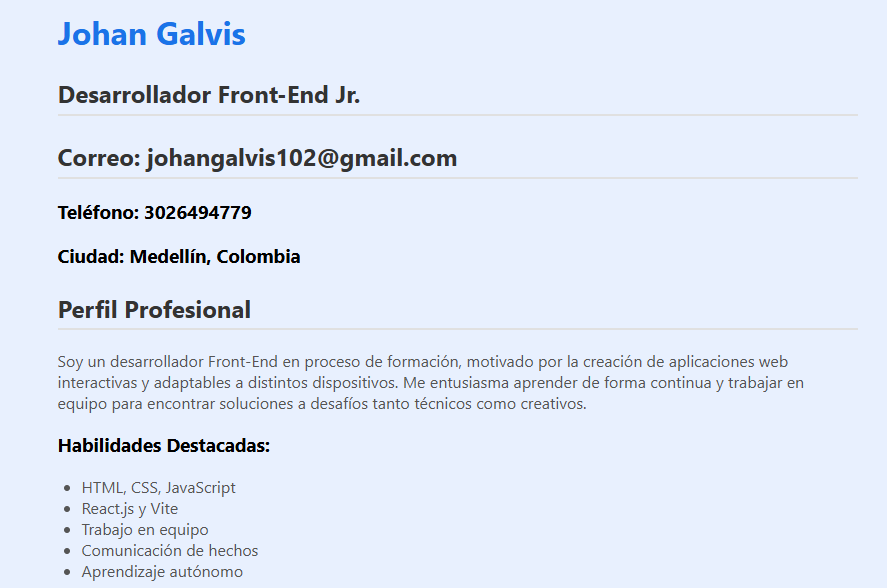

# cv-react-johan-galvis
""


## Descripción

Este proyecto es una hoja de vida modular creada en React con Vite. Incluye renderizado condicional, listas dinámicas y uso de componentes funcionales.

## Instalación

```bash
cd mi-app-react
npm install
npm run dev
